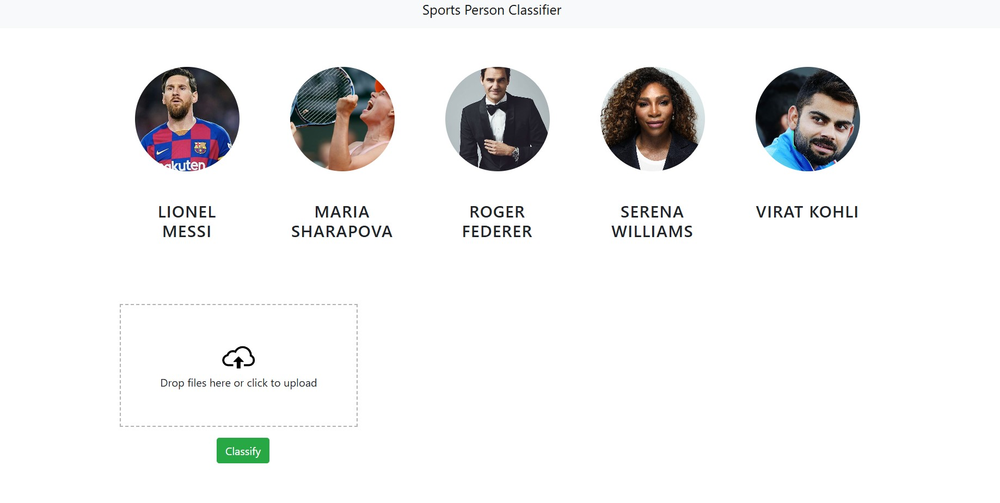

# Sports Celebrity Image Classification

Welcome to the Sports Celebrity Image Classification project! This repository contains the code and resources for an image classification system that identifies sports celebrities using various machine learning algorithms. The project involves training machine learning models on images of sports personalities, creating a web interface for visualization, and deploying the solution using a Python Flask server.

## Table of Contents

- [Project Overview](#project-overview)
- [Features](#features)
- [Technologies Used](#technologies-used)
- [Installation](#installation)
- [Usage](#usage)
- [Project Structure](#project-structure)
- [Model Training](#model-training)
- [Web Application](#web-application)
- [Deployment](#deployment)
- [Upload Images](#upload-images)
- [Contributing](#contributing)
- [License](#license)

## Project Overview

This project aims to build a machine learning-based image classification system to recognize sports celebrities. It uses multiple machine learning algorithms including Support Vector Machines (SVM), Logistic Regression, and Random Forest to classify images of sports personalities. The trained models are then deployed using a Flask server, with a web application interface for users to upload and classify images.

## Features

- **Multiple Machine Learning Models**: Includes SVM, Logistic Regression, and Random Forest.
- **Image Preprocessing**: Crops and preprocesses images to enhance model accuracy.
- **Wavelet Transform**: Uses wavelet transformation for feature extraction.
- **Web Interface**: Provides a user-friendly web interface for image classification.
- **Flask Server**: Deploys the machine learning models using a Python Flask server.

## Technologies Used

- Python
  - scikit-learn
  - OpenCV
  - NumPy
  - Flask
  - Joblib
- HTML, CSS, JavaScript
- Bootstrap (for responsive design)

## Installation

1. **Clone the repository:**

   ```bash
   git clone https://github.com/yourusername/sports-celebrity-classification.git
   cd sports-celebrity-classification
   ```

2. **Create and activate a virtual environment:**

   ```bash
   python -m venv venv
   source venv/bin/activate  # On Windows use `venv\Scripts\activate`
   ```

3. **Install the required packages:**

   ```bash
   pip install -r requirements.txt
   ```

4. **Download the necessary Haarcascades for face and eye detection:**

   ```bash
   mkdir -p opencv/haarcascades
   cd opencv/haarcascades
   curl -O https://github.com/opencv/opencv/raw/master/data/haarcascades/haarcascade_frontalface_default.xml
   curl -O https://github.com/opencv/opencv/raw/master/data/haarcascades/haarcascade_eye.xml
   cd ../../
   ```

## Usage

1. **Start the Flask server:**

   ```bash
   python server/server.py
   ```

2. **Open your web browser and navigate to:**

   ```
   http://127.0.0.1:5000/
   ```

3. **Upload an image** using the web interface to classify it.

## Project Structure

```
sports-celebrity-classification/
├── artifacts/
│   ├── saved_model.pkl
│   ├── class_dictionary.json
├── opencv/
│   └── haarcascades/
│       ├── haarcascade_frontalface_default.xml
│       └── haarcascade_eye.xml
├── server/
│   ├── server.py
│   └── util.py
├── static/
│   ├── css/
│   ├── js/
│   └── images/
├── templates/
│   └── index.html
├── README.md
├── requirements.txt
└── .gitignore
```

## Model Training

The models were trained using images of various sports celebrities. The training process involved:

1. **Data Collection**: Images were collected from various sources.
2. **Data Preprocessing**: Images were preprocessed using OpenCV, including cropping and resizing.
3. **Feature Extraction**: Wavelet transformation was used for feature extraction.
4. **Model Training**: Various machine learning models were trained using scikit-learn.

The trained models were saved using Joblib for later use in the Flask server.

## Web Application

The web application allows users to upload images and get predictions on the sports celebrity depicted in the image. It provides a simple and intuitive interface built using HTML, CSS, and JavaScript, with Bootstrap for responsiveness.

## Deployment

The Flask server handles the backend logic for image classification. It loads the trained models and provides endpoints for the web application to interact with. To deploy the server:

1. **Ensure all dependencies are installed**: Follow the installation steps.
2. **Start the server**: Run `python server/server.py`.
3. **Access the web application**: Navigate to `http://127.0.0.1:5000/`.

## Upload Images

Below are some sample images of the web application's upload section. This section provides a user-friendly interface to upload images for classification.

<div style="border: 1px solid #ccc; padding: 10px; margin-bottom: 10px;">
    
</div>

<div style="border: 1px solid #ccc; padding: 10px;">
    
</div>

## Contributing

We welcome contributions to enhance the functionality and performance of this project. Please fork the repository, make your changes, and submit a pull request.

## License

This project is licensed under the MIT License. See the [LICENSE](LICENSE) file for more details.

---

Thank you for checking out the Sports Celebrity Image Classification project! If you have any questions or suggestions, feel free to open an issue or contact us directly.

Happy coding!
